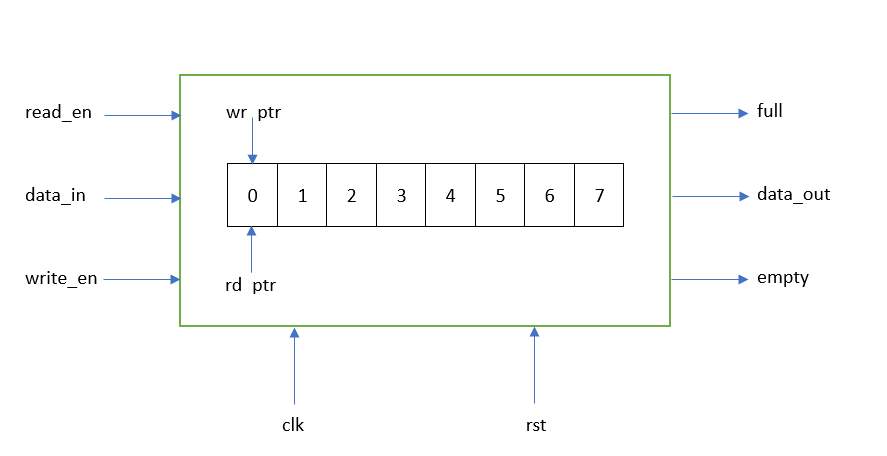
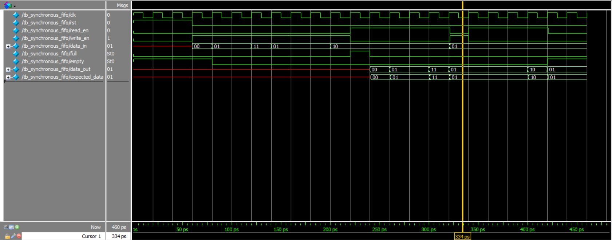

# Synchronous FIFO (Verilog)

## 📌 Description
This project implements a **parameterized Synchronous FIFO (First-In First-Out)** using Verilog HDL.

The FIFO stores data in a circular buffer and ensures that:

> The first data written is the first data read.

The design includes both **RTL implementation** and a **self-checking testbench** for functional verification.

---

## 🧠 Design Overview

The FIFO operates in a **single clock domain** and uses:

- Memory array for storage  
- Separate read and write pointers  
- Circular addressing  
- Full and empty detection logic  

The design supports **simultaneous read and write operations**.

---

## 🧩 Block Diagram

---

## 🏗️ Architecture

### Memory

mem[0 : DEPTH-1]

### Pointers
- `wr_ptr` → Write pointer  
- `rd_ptr` → Read pointer  

### Pointer Structure

[MSB | Address Bits]

- Lower bits → memory indexing  
- MSB → wrap tracking (for full detection)

---

## 🔁 Operation

### Write Operation
Data is written when:

write_en = 1 AND full = 0

- Data stored at `wr_ptr`
- Pointer increments circularly

---

### Read Operation
Data is read when:

read_en = 1 AND empty = 0

- Data read from `rd_ptr`
- Pointer increments circularly

---

## 🚩 Status Signals

### Empty Condition

wr_ptr == rd_ptr

### Full Condition

MSB different AND lower bits equal

This removes ambiguity between full and empty states.

---

## 🛠 Design Details

- Parameterized FIFO (**DEPTH, DATA_WIDTH**)  
- Circular buffer implementation  
- Extra pointer bit technique  
- Synthesizable RTL  
- Supports concurrent read/write  

---

## 📂 Module Interface

### Inputs
- `clk` : System clock  
- `rst` : Asynchronous reset  
- `write_en` : Write enable  
- `read_en` : Read enable  
- `data_in` : Input data  

### Outputs
- `data_out` : Output data  
- `full` : FIFO full flag  
- `empty` : FIFO empty flag  

---

## 🧪 Testbench

The FIFO is verified using a **self-checking testbench**.

### Key Features

- Task-based stimulus (`write_data`, `read_data`)  
- Random input generation  
- Reference queue (scoreboard)  
- Automatic checking:
    data_out vs expected_data
- Timing-correct comparison using `#1`

---

## 📊 Simulation

The waveform verifies correct FIFO behavior.

Example:

Write → Store data
Read → Output matches expected_data

✔ Ensures correct FIFO sequencing  

---

## 🧰 Tools Used

- Verilog HDL  
- ModelSim / QuestaSim  

---

## 🎯 Learning Outcomes

This project helped reinforce:

- FIFO design using circular buffers  
- Pointer-based memory addressing  
- Full and empty detection logic  
- Non-blocking assignment timing  
- Self-checking testbench design  
- Debugging using waveform analysis  

---
