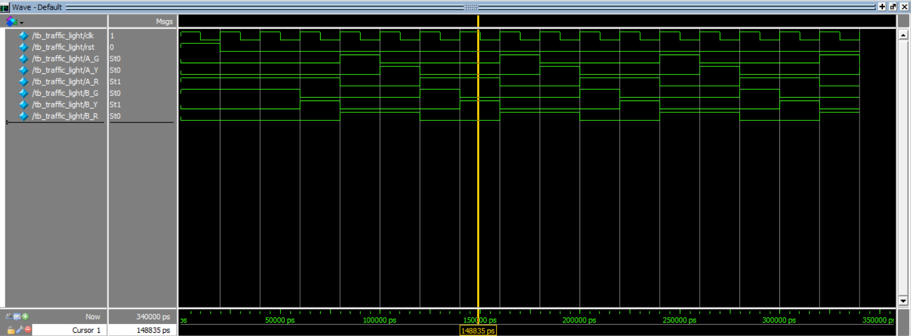

# Traffic Light Controller (Moore FSM)

## 📌 Description
This project implements a simple traffic light controller using a **Moore Finite State Machine (FSM)** in Verilog HDL.

The controller manages traffic signals for a **two-road intersection** (Road A and Road B). The lights change sequentially based on predefined FSM states.

The design demonstrates fundamental FSM concepts used in digital system design.

---

## 🧠 FSM Design

The controller uses **4 states** encoded using **2-bit state encoding**.

| State | Road A | Road B |
|------|------|------|
| S0 | Red | Green |
| S1 | Red | Yellow |
| S2 | Green | Red |
| S3 | Yellow | Red |

State transitions occur on every clock cycle in the following order:

S0 → S1 → S2 → S3 → S0

---

## 🔁 State Encoding

| State | Encoding |
|------|---------|
| S0 | 2'b00 |
| S1 | 2'b01 |
| S2 | 2'b10 |
| S3 | 2'b11 |

---

## 🛠 Design Details

- Moore FSM architecture
- 2 flip-flop state register
- 4 FSM states
- Registered outputs
- Synchronous state transitions
- Asynchronous active-high reset

---

## 📂 Module Interface

### Inputs
- `clk` : System clock
- `rst` : Asynchronous reset

### Outputs
- `A_G` : Road A Green
- `A_Y` : Road A Yellow
- `A_R` : Road A Red
- `B_G` : Road B Green
- `B_Y` : Road B Yellow
- `B_R` : Road B Red

---

## 📊 Simulation

The waveform verifies correct traffic light sequencing across FSM states.

Example sequence:

Road B Green → Road B Yellow → Road A Green → Road A Yellow → repeat

---

## 🧰 Tools Used

- Verilog HDL
- ModelSim (Intel FPGA Edition)

---

## 🎯 Learning Outcomes

This project helped reinforce the following RTL design concepts:

- Finite State Machine (FSM) design
- Moore vs Mealy machine behavior
- State encoding
- Sequential logic design
- Registered outputs in FSM
- Simulation and waveform analysis

---