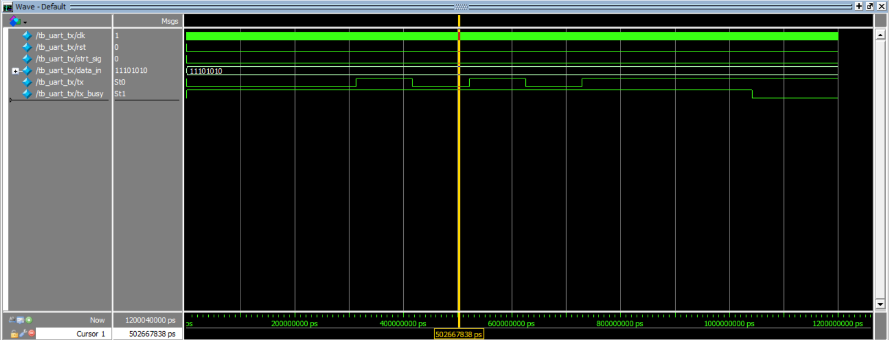
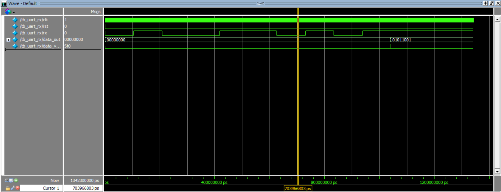

# UART Transmitter and Receiver (Verilog RTL)

## 📌 Project Overview

This project implements a **Universal Asynchronous Receiver Transmitter (UART)** using **Verilog HDL**.
The design includes both a **UART Transmitter (TX)** and **UART Receiver (RX)** along with separate **testbenches for verification**.

The receiver uses **16× oversampling** to accurately detect and sample incoming serial data.

All modules were simulated using **ModelSim**.

---

# 📂 Project Structure

```id="fs0sx3"
uart/
│
├── rtl/
│   ├── uart_tx.v
│   ├── uart_rx.v
│   ├── baud_rate_generator.v
│   └── baud16_rate_generator.v
│
├── tb/
│   ├── tb_uart_tx.v
│   └── tb_uart_rx.v
│
├── sim/
│   ├── uart_tx_waveform.png
│   └── uart_rx_waveform.png
│
└── README.md
```

---

# UART Protocol Basics

UART transmits data asynchronously using a **start bit, data bits, and stop bit**.

Frame format:

```id="k3xg61"
Idle → Start → Data[0] → Data[1] → ... → Data[7] → Stop
```

| Field      | Value     |
| ---------- | --------- |
| Idle       | 1         |
| Start Bit  | 0         |
| Data Bits  | 8 bits    |
| Data Order | LSB First |
| Stop Bit   | 1         |

---

# 🔹 UART Transmitter

## Description

The UART transmitter converts **parallel 8-bit input data** into a **serial data stream**.

Transmission begins when the **start signal** is asserted.

---

## Transmitter Architecture

```id="3djsml"
             +----------------------+
             |  Baud Rate Generator |
             |     (9600 baud)      |
             +----------+-----------+
                        |
                        v
                 +-------------+
 data_in[7:0] →  | Shift Reg   |
                 | Serializer  |
                 +------+------+ 
                        |
                        v
                 +-------------+
 start_signal →  |   TX FSM    |
                 | IDLE        |
                 | START       |
                 | DATA        |
                 | STOP        |
                 +------+------+ 
                        |
                        v
                       tx
```

---

## FSM States

| State | Function                       |
| ----- | ------------------------------ |
| IDLE  | Waits for transmission request |
| START | Sends start bit (`0`)          |
| DATA  | Sends 8 data bits (LSB first)  |
| STOP  | Sends stop bit (`1`)           |

---

## Transmitter Outputs

| Signal    | Description                        |
| --------- | ---------------------------------- |
| `tx`      | Serial output data                 |
| `tx_busy` | Indicates transmission in progress |

---

## Transmitter Testbench

`tb_uart_tx.v` verifies the transmitter by:

* Providing parallel input data
* Triggering transmission
* Observing serialized output on `tx`

---

# 🔹 UART Receiver

## Description

The UART receiver converts **serial input data** into **parallel 8-bit output**.

The receiver uses **16× oversampling** to accurately detect and sample incoming bits.

---

## Receiver Architecture

```id="dw1x7c"
RX Input
   │
   ▼
2-FF Synchronizer
   │
   ▼
Start Bit Edge Detection
   │
   ▼
16× Baud Tick Generator
   │
   ▼
Oversampling Counter
   │
   ▼
FSM Controller
   │
   ├── Bit Counter
   └── Shift Register
   │
   ▼
Data Output + Data Valid
```

---

## Receiver FSM States

| State | Function              |
| ----- | --------------------- |
| IDLE  | Waits for start bit   |
| START | Validates start bit   |
| DATA  | Samples incoming bits |
| STOP  | Validates stop bit    |
| DONE  | Output data is ready  |

---

## Receiver Features

* **2-Flip-Flop Synchronizer** to avoid metastability
* **Falling edge start bit detection**
* **16× oversampling for accurate sampling**
* **Mid-bit sampling**
* **Shift register based serial-to-parallel conversion**
* **Stop bit verification**
* `data_valid` signal indicates successful reception

---

## Receiver Testbench

`tb_uart_rx.v` verifies receiver behavior by:

* Generating UART frames
* Driving serial input on `rx`
* Observing decoded output `data_out`

---

# Simulation Results

## UART Transmitter



The waveform shows:

* Start bit generation
* Bit-by-bit transmission
* Stop bit completion

---

## UART Receiver



The waveform shows:

* Start bit detection
* Oversampled bit sampling
* Shift register filling
* Final parallel output with `data_valid`

---

# 🛠 Tools Used

* **Verilog HDL**
* **ModelSim (Intel FPGA Edition)**

---

# 🎯 Learning Outcomes

Through this project I practiced:

* RTL design using **Verilog**
* **Finite State Machine (FSM)** implementation
* UART serial communication protocol
* **Oversampling techniques for asynchronous data**
* **Synchronizer design for asynchronous inputs**
* Testbench development and waveform debugging

---

# 📈 Possible Improvements

Future extensions to this design:

* Configurable baud rate
* Parity bit support
* Parameterized data width
* UART loopback system (`tx → rx`)
* FPGA implementation

---

# 📜 License

This project is licensed under the **MIT License**.
